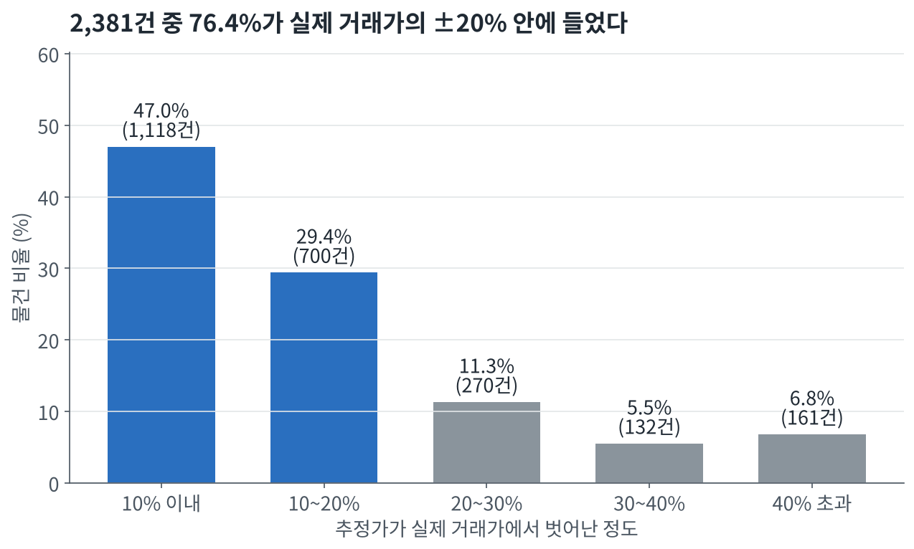

# villa-price-estimator

서울 다세대·연립(빌라)의 매매 시세를 추정한다. 지번·층·호를 넣으면 추정 시세, 가격 구간, 신뢰도, 산출 근거를 돌려준다.

- 대상 권역: 서울특별시 강서구 화곡동, 강남구, 관악구
- 산출 기준일: 2026-10-06
- 방식: 요인별 가격식(회귀) + 같은 건물·주변 실거래 보정(비교사례)
- 자체 검증(처음 보는 물건 2,381건): 중앙값 오차율 10.6%, 실제 거래가의 ±20% 안에 든 비율 76.4%

## 실행

라이브러리를 먼저 설치해야 한다. 설치하지 않고 실행하면 `ModuleNotFoundError: No module named 'pandas'`가 나온다.

```bash
# pip를 쓰는 경우 (Python 3.11 이상)
pip install -r requirements.txt
python predict.py --input input.csv --output output.csv

# uv를 쓰는 경우 (Python 3.12 이상을 uv가 알아서 준비한다)
uv sync
uv run python predict.py --input input.csv --output output.csv
```

uv로 설치했다면 라이브러리는 `.venv` 안에 있다. `python predict.py`를 직접 치려면 가상환경을 먼저 켜거나(`.venv\Scripts\activate`, macOS·Linux는 `source .venv/bin/activate`) `uv run`을 앞에 붙인다.

pip 설치는 Python 3.11, 3.12, 3.13에서 확인했다. 설치 목록의 최소 버전(numpy 1.26, pandas 2.1, scikit-learn 1.3)에서도 테스트 149개가 통과하고 출력 파일이 같다. Python 3.10 이하는 확인하지 않았다.

예시 입력으로 바로 돌려 볼 수 있다. 20건 기준 몇 초 안에 끝난다.

```bash
uv run python predict.py --input examples/input.csv --output output.csv
```

### 입력 `input.csv`

| 컬럼 | 예시 | 비고 |
|---|---|---|
| id | 1 | 식별자 |
| sigungu | 서울특별시 관악구 | 시군구 |
| dong | 봉천동 | 법정동 |
| jibun | 123-45 | 지번 |
| floor | 3 | 층. 지하는 `-1` 또는 `B1` |
| ho | 301 | 호. 비어 있어도 된다. 동을 함께 적어도 된다 (`B동 201`, `102-402`) |
| area_m2 | 42.5 | 전용면적. 비어 있어도 된다 |

### 출력 `output.csv`

| 컬럼 | 예시 | 비고 |
|---|---|---|
| id | 1 | 입력과 같다 |
| price_est | 285000000 | 추정 시세(원) |
| price_low | 260000000 | 가격 구간 하한 |
| price_high | 310000000 | 가격 구간 상한 |
| confidence | 0.72 | 추정가가 실제 거래가의 ±20% 안에 들 확률 |
| basis | 같은 건물 3건·반경 100m 51건 실거래 반영(가격식 대비 -21%) / 2012년 준공 4층 29.87㎡ 다세대 | 산출 근거 |
| status | ok | 산출하지 못하면 `fail: 사유` |

한 줄에서 문제가 생겨도 멈추지 않고, 그 줄만 `fail`로 남긴다. 권역 밖 주소, 읽을 수 없는 지번·층, 실거래·좌표·건축물대장 어디에서도 확인되지 않는 지번이 실패 사유다.

출력 파일은 UTF-8(BOM 포함)로 저장한다. 엑셀에서 열어도 한글이 깨지지 않게 하기 위해서다. 
pandas는 그대로 읽고, 파이썬 기본 `open()`으로 읽을 때는 `encoding="utf-8-sig"`를 쓴다. 
실패한 줄은 가격 세 칸을 비우고 `confidence`를 0으로 적는다. 입력 파일은 UTF-8(BOM 있어도 됨)과 CP949를 모두 읽는다.

## API 키 (선택)

수집해 둔 `data/trades.db`만으로도 동작한다. 아래 키를 환경변수로 넣으면 DB에 없는 값을 실행 중에 조회한다.

| 환경변수 | 쓰는 곳 | 없을 때 |
|---|---|---|
| `DATA_GO_KR_KEY` | 건축물대장에서 전용면적(호 기준)·준공년도 조회 | 같은 건물 실거래 기록으로 어림하고 신뢰도를 낮춘다 |
| `KAKAO_REST_KEY` | 수집되지 않은 지번의 좌표 조회 | 같은 건물 거래만 반영한다 |

발급 방법

1. **공공데이터포털** (data.go.kr): 로그인 후 `국토교통부_건축HUB_건축물대장정보 서비스`를 검색해 활용신청한다. 자동 승인된다. 마이페이지의 일반 인증키를 쓴다. Encoding 키와 Decoding 키 어느 쪽을 넣어도 된다.
2. **Kakao Developers** (developers.kakao.com): 애플리케이션을 만들고 REST API 키를 쓴다. 앱의 제품 설정에서 카카오맵을 켜야 한다.

넣는 방법

```bash
# .env 파일을 쓰는 경우 (.env.example을 복사해 값을 채운다)
uv run --env-file .env python predict.py --input input.csv --output output.csv

# 직접 넣는 경우
export DATA_GO_KR_KEY=...      # PowerShell: $env:DATA_GO_KR_KEY="..."
export KAKAO_REST_KEY=...
```

## 폴더 구조

```
predict.py            제출 프로그램. 입력 CSV -> 출력 CSV
validate.py           홀드아웃으로 모델별 오차를 잰다
validate_predict.py   제출 프로그램을 그대로 돌려 오차를 잰다 (면적 입력 / 면적 없음 / 대상 거래 제외)
report.py             검증 결과를 reports/validation.md로 정리한다
chart_data.py         그래프에 쓸 숫자를 CSV로 뽑아 reports/charts/data/에 저장한다
charts.py             그 CSV만 읽어 그래프를 그리고 reports/charts/에 PNG로 저장한다
collect/
  fetch_trades.py     실거래가 API -> data/raw/trades/*.csv
  geocode_trades.py   지번 -> 좌표 (Kakao) -> geocode 테이블
  probe_building.py   건축물대장 API 응답 확인용
model/
  normalize.py        금액·지번·날짜 문자열 변환
  clean.py            원본 CSV 정제 -> data/trades.db
  holdout.py          검증 규칙 (홀드아웃, 같은 호 제외, dev/test)
  baseline.py         기준선: 동별 ㎡당 중앙값 × 면적
  formula.py          가격식: 요인별 회귀
  estimate.py         가격식 + 실거래 보정
  confidence.py       신뢰도와 가격 구간
  confidence.json     학습된 신뢰도 식
  geocode.py          Kakao 주소 검색
  building.py         건축물대장 조회
  resolve.py          입력에 없는 면적·준공년도·좌표 채우기
data/trades.db        정제된 실거래와 좌표 (SQLite)
reports/              검증 결과
examples/input.csv    예시 입력
tests/                테스트 149개
```

## 사용 데이터

| 데이터 | 출처 | 범위 | 건수 |
|---|---|---|---|
| 연립다세대 매매 실거래가 | 국토교통부 (공공데이터포털 API) | 강서구·강남구·관악구, 계약 2021.10 ~ 2026.10 | 원본 26,784건 → 정제 후 21,220건 |
| 지번 좌표, 법정동코드 | Kakao 로컬 API 주소 검색 | 위 거래의 고유 지번 | 7,511개 중 7,508개 변환 |
| 건축물대장 표제부·전유공용면적 | 국토교통부 건축HUB (공공데이터포털 API) | 실행 중 필요한 지번만 조회 | 저장하지 않음 |

정제에서 뺀 것은 해제된 거래 1,609건과 강서구 중 화곡동이 아닌 거래 3,955건이다. 가격이 높거나 낮은 실제 거래는 지우지 않았다. 연립도 포함했다(2,109건). 수집일은 2026-10-06이며, 신고 기한(계약 후 30일) 때문에 마지막 한두 달은 건수가 덜 찼다.

상용 시세 서비스의 값은 입력에도 학습에도 쓰지 않았다. 소유자 등 개인정보는 수집하지 않았다.

## 모델

1. **가격식** (`model/formula.py`): 권역마다 ㎡당 가격을 동·거래 시점·연식·면적·층·주택 유형·거래 방식으로 설명하는 회귀식을 만든다.
2. **실거래 보정** (`model/estimate.py`): 같은 건물과 주변 실거래가 가격식보다 몇 % 비싸게/싸게 팔렸는지를 가중평균해 보정한다. 가까울수록(50m), 최근일수록(24개월), 같은 건물일수록(10배) 크게 반영한다.
3. **신뢰도** (`model/confidence.py`): 추정가가 실제의 ±20% 안에 들 확률. 근거 거래의 양과 흩어짐, 지하층·1층, 신축·노후로 정한다. 가격 구간은 신뢰도 구간별로 실제 거래가의 80%가 들어온 폭이다. 추정가에 같은 비율을 곱하고 나눠 만들기 때문에 아래쪽 폭과 위쪽 폭이 다르다.

추정 대상과 같은 호로 보이는 거래(같은 지번·층·면적)는 가격식 학습과 보정 양쪽에서 뺀다. 실거래가에는 호가 없어서 이 세 가지가 같으면 같은 호로 본다.

물건은 한 건씩 따로 추정한다. 가격식도 물건마다 그 물건과 같은 호의 거래만 빼고 만들기 때문에, 같은 물건은 입력 CSV에 다른 줄이 몇 개 있든 같은 값이 나온다.

## 자체 검증

기준일로부터 12개월 안의 거래 4,860건을 홀드아웃으로 삼았다. 지번 기준으로 반씩 나눠 dev(2,479건)로 설정값을 고르고 test(2,381건)는 성적 확인에만 썼다.

| 모델 | 중앙값 오차율 | 20% 이내 |
|---|---|---|
| 기준선 (동별 ㎡당 중앙값 × 면적) | 28.6% | 35.3% |
| 가격식 | 17.2% | 56.9% |
| 가격식 + 실거래 보정 | 10.6% | 76.4% |

| 신뢰도 구간 | 말한 신뢰도 | 실제로 20% 이내 | 가격 구간 (추정가 대비) |
|---|---|---|---|
| 0.6 미만 | 0.47 | 0.53 | -34% ~ +51% |
| 0.6 ~ 0.7 | 0.66 | 0.60 | -26% ~ +36% |
| 0.7 ~ 0.8 | 0.76 | 0.74 | -20% ~ +25% |
| 0.8 이상 | 0.84 | 0.87 | -16% ~ +19% |

### 제출 프로그램을 그대로 돌린 검증

위 표는 설정값을 고를 때 쓴 방식(`validate.py`)으로 잰 것이다. 실거래의 면적을 그대로 쓰고, 가격식은 지번 5묶음 중 맞혀 볼 묶음의 최근 12개월 거래를 전부 빼고 만든다. 제출 프로그램은 대상과 같은 호의 거래만 빼므로 방식이 조금 다르다.

그래서 같은 test 2,381건을 입력 한 줄(시군구·동·지번·층)로 바꿔 `predict()`에 그대로 넣고 다시 쟀다(`validate_predict.py`). 값 채우기, 물건별 가격식, 신뢰도 감점까지 채점 때와 같은 경로다.

| 입력 | 실패 | 중앙값 오차율 | 20% 이내 | 말한 신뢰도 | 실제로 20% 이내 | 가격 구간에 든 비율 |
|---|---|---|---|---|---|---|
| 면적 입력 | 0건 | 10.6% | 76.1% | 0.76 | 0.76 | 0.80 |
| 면적 없음 | 0건 | 11.2% | 73.7% | 0.70 | 0.74 | 0.83 |
| 면적 없음, 대상 거래 제외 | 0건 | 13.7% | 63.8% | 0.58 | 0.64 | 0.81 |

세 줄 모두 키 없이 수집해 둔 DB만 쓴 결과다.

- **면적 입력**: `validate.py`의 결과(10.6%, 76.4%)와 같은 수준이다.
- **면적 없음**: 같은 건물 실거래 기록에서 면적을 찾는다. 대상 물건 자신의 거래 기록도 DB에 있으므로 그 면적을 되찾는 경우가 많다. test의 51.5%(1,227건)는 그 층의 기록이 대상 거래 한 건뿐이라 면적이 그대로 복원된다. 가격은 쓰지 않는다(같은 호의 거래는 가격식과 보정에서 빠진다). 블라인드 검증 물건도 최근 12개월 실거래에서 뽑히므로 수집일 전에 신고된 거래라면 이 조건에 해당한다.
- **대상 거래 제외**: 대상 거래 한 건을 DB에서 지우고 쟀다. 수집일 뒤에 신고된 거래의 물건이 이 조건에 해당한다. 같은 호의 이전 거래는 지우지 않았으므로(661건은 그런 거래가 남아 있다), 처음 거래되는 물건만의 성능은 아니다. 면적을 건물의 다른 호나 동 중앙값으로 어림하는 경우가 늘어 오차가 13.7%로 커진다. 신뢰도는 0.58로 낮춰 말하고 실제 적중률(0.64)보다 조심스럽다. 이 경우를 줄이는 방법이 건축물대장 조회(`DATA_GO_KR_KEY`)다.
- 실거래가에는 호가 없어서, 건축물대장에서 호로 면적을 찾는 경로는 이 표에 들어 있지 않다. 따로 50건을 실제로 조회해 확인했다(`--online`). 대장에서 같은 층·같은 면적의 호를 찾아 그 이름을 입력으로 넣는 방식이다.
  - 50건 모두 대장이 조회됐고, 같은 층에 실거래와 면적이 같은 호가 있었다.
  - 호 이름만 넣었을 때 44건은 같은 면적을 되찾았다. 나머지 6건은 한 지번에 동이 여럿(A동·B동, 101동·102동)이라 같은 호 이름이 동마다 있는 경우였다.
  - 그래서 호에 동을 함께 적으면("B동 201", "102-402") 그 동에서 찾고, 동이 없으면 그 층에서 실제로 거래된 면적과 같은 쪽을 고르도록 했다. 가릴 수 없으면 동별 면적의 중앙값을 쓰고 신뢰도를 낮춘다. 고친 뒤 같은 50건은 모두 같은 면적을 되찾았다.
  - 입력한 동이 대장에 없으면(A동만 있는데 "B동 201") 호 이름만으로 찾되, 근거에 동 불일치를 남기고 신뢰도를 낮춘다.

조건별 오차, 크게 틀린 사례, 예시 산출 3건은 [reports/validation.md](reports/validation.md)에, 그래프는 [reports/charts/](reports/charts/)에, 그래프에 쓴 숫자는 [reports/charts/data/](reports/charts/data/)에 CSV로 있다.



## 다시 만들기

데이터 수집부터 리포트까지 순서대로 실행하면 같은 결과가 나온다. 수집에는 두 키가 모두 필요하다. 실거래가 수집은 `국토교통부_연립다세대 매매 실거래가 자료` 활용신청이 추가로 필요하다.

```bash
uv run --env-file .env python collect/fetch_trades.py --start 202110 --end 202610
uv run python -m model.clean
uv run --env-file .env python -m collect.geocode_trades
uv run python validate.py --save reports/holdout.csv
uv run python -m model.confidence
uv run python report.py
uv run python validate_predict.py
uv run python chart_data.py
uv run python charts.py
uv run pytest
```

## 한계

- 직거래는 시세보다 낮게 거래되는 경우가 많은데, 입력으로는 거래 방식을 알 수 없다. 크게 틀린 사례의 38.5%가 직거래다.
- 지하층(중앙값 오차율 19.8%)과 준공 30년 이상(14.3%)에서 오차가 크다. 재개발 기대처럼 실거래가에 없는 요인이 가격을 움직인다.
- 준공 1년 이내 신축은 12.2% 높게 추정하는 경향이 있다.
- 추정은 기준일 시세다. 9~12개월 전 거래와 비교하면 그사이 시세 변화만큼 차이가 난다.
- 면적·준공년도를 어림한 경우의 신뢰도 감점은 규칙으로 정했다. 면적을 비운 검증에서는 말한 신뢰도(0.70, 대상 거래를 뺀 조건은 0.58)가 실제(0.74, 0.64)보다 낮아 조심스러운 쪽이다.
- 수집일(2026-10-06) 뒤에 신고된 거래의 물건은 DB에 기록이 없다. 면적이 비어 있고 건축물대장 키도 없으면 면적을 어림하게 되어 오차가 커진다(중앙값 13.7%).
- 건축물대장에서 호로 면적을 찾는 경로는 50건으로만 확인했다. 한 지번에 동이 여럿인데 입력에 동이 없으면 호를 하나로 특정하지 못할 수 있다.
